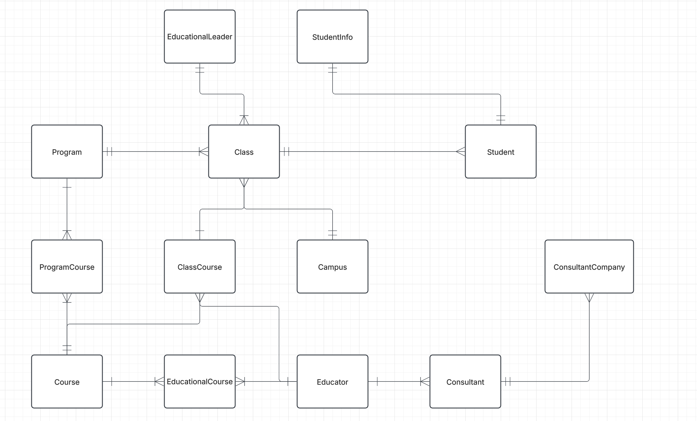

## Building a database for YrkesCo

This document describes the process of designing a database model for YrkesCo. It includes multiple data models along with detailed explanations.

## Table of contents
- [Business requirements](#business-requirements)
- [Conceptual model](#conceptual-model)
- [Relationships statements for each entity](#relationships-statements-for-each-entity)
- [Logical model](#logical-model)
- [Physical model](#physical-model)
- [Arguing for normalisation](#arguing-for-normalisation)

# Business requirements

- Students: First name, last name, personal identification number, and email.

- Trainers: Can be consultants.

- Permanent trainers: They plan to hire full-time trainers (BONUS).

- Education managers: Their personal details.

- Education managers: Responsible for 3 classes.

- Courses: Name, course code, number of credits, and a short description.

- Programs: Consist of multiple courses.

- Program approval: A program is approved in three rounds, meaning there are three classes.

- Standalone courses: Also available (BONUS).

- Consultants: Their company details, including organization number, F-tax status, address, and hourly rate.

- Facilities: YrkesCo has two locations, one in Gothenburg and one in Stockholm. In the future, they may expand to more cities (BONUS).

# Conceptual model

# Relationships statements for each entity

- A `student` is enrolled in one `class`
- A `student` has exactly one associated `studentInformation` containing sensitive personal data
- A `class` has many `students`
- A `class` belongs to one `program`
- A `class` is managed by one `educational leader`
- A `class` is connected to `multiple` courses through `ClassCourse`
- An `educational leader` can be `responsible` for up to `three classes`
- A `program `includes multiple `classes`
- A `program` can have several `courses`
- A `course` can be part of multiple programs.
- A `course` can be given in `multiple classes` via `ClassCourse`
- A `course` can be taught by multiple educators through EducationalCourse.
- A `ProgramCourse`connects programs to their respective `courses`
- `ClassCourse` links classes to the `courses` they take.
- Each `ClassCourse` is taught by one `educator`
- A `campus` can host multiple `classes`
- An `educator` can teach many courses through `EducationalCourse`
- An `educator`can be assigned to `multiple ClassCourses`
- An `educator` can be a `consultant`
- `EducationalCourse` connects `educators` to the `courses` they are qualified to teach.
- A `consultant` can also be an `educator`
- A `consultant company` can employ multiple `consultants`

# Logical model

# Physical model

# Arguing for normalisation